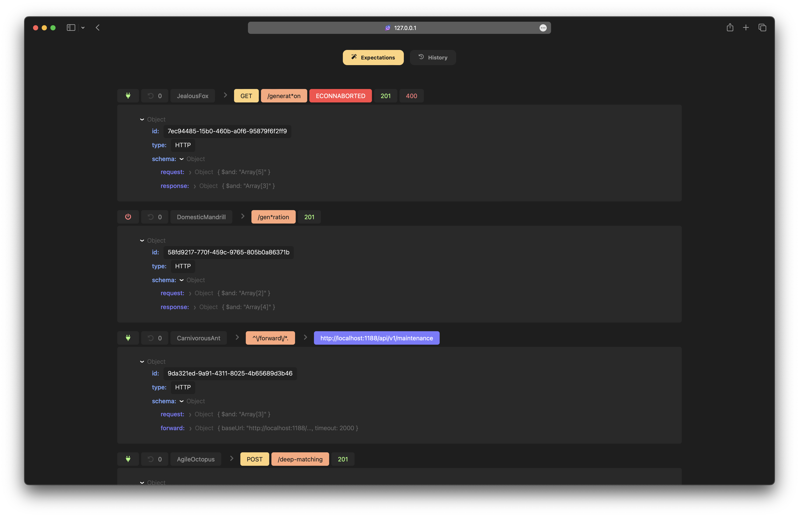
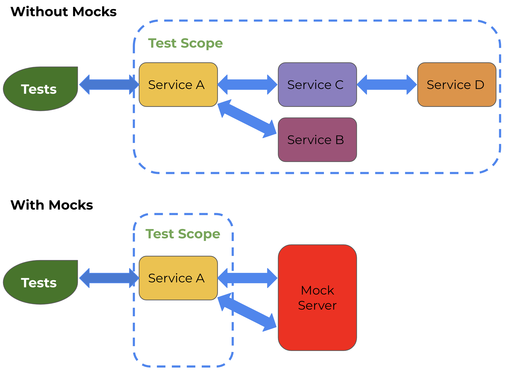
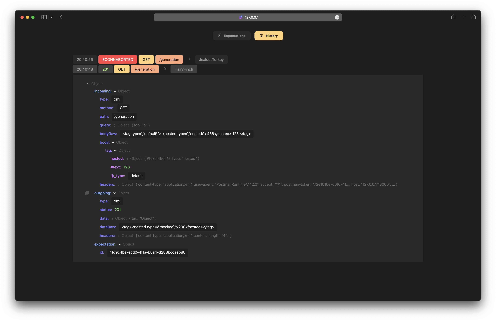

# Mock server

Mock, match, modify and manipulate a HTTP request/response payload using flexible expectations with types



# Navigation

- [Basics](#basics)
    - [How it works](#how-it-works)
    - [Install](#install)
    - [Start](#start)
    - [GUI](#gui)
    - [Mock](#mock)
- [Expectations](#expectations)
	- [Schema](#schema)
	- [Forwarding](#forwarding)
	- [Context](#context)
	- [Utils](#utils)
	- [Operators](#operators)
	- [Typings](#typings)
	- [Storage](#storage)
	- [Containers](#containers)
	- [Cache](#cache)
	- [State](#state)
	- [Seeds](#seeds)
	- [XML](#xml)
- [API](#api)
	- [Ping](#ping)
	- [Create expectation](#create-expectation)
	- [Update expectation](#update-expectation)
	- [Delete expectation](#delete-expectation)
- [Additional](#additional)
    - [Configuration](#configuration)
    - [Logger](#logger)
    - [Meta](#meta)

# Basics

## How it works



According on the picture above, main idea is to generate or modify response from some backend service. The mock server provides many scenarios to do that

**In case of mocking without request forwarding:**

1. Start mock server (for example on `localhost:8080`)
2. Register expectation using CLI (cURL) or application lib
3. Make request to `localhost:8080/...`
    1. The mock server matches a request payload with registred expectations
    2. Build a response using an expectation configuration

**In case of mocking with request forwarding:**

0. Lets imagine that you have a service that hosts on `localhost:8081`
1. Start mock server (for example on `localhost:8080`)
2. Register expectation using CLI (cURL) or application lib
3. Make request to `localhost:8080/...`
    1. The mock server matches a request payload with registred expectations
    2. Next is forwarding a request payload to `localhost:8081/...`
    3. Using response fetched from `localhost:8081/...` the mock server builds a response


## Install

```bash
npm i @n1k1t/mock-server
```

## Start

### CLI

```bash
npx @n1k1t/mock-server -h localhost -p 8080
```

### JavaScript

```js
const { MockServer } = require('@n1k1t/mock-server');
MockServer.start({ host: 'localhost', port: 8080 });
```

### TypeScript

```ts
import { MockServer } from '@n1k1t/mock-server';
MockServer.start({ host: 'localhost', port: 8080 });
```

## GUI

The mock server provides built-in web panel to track everything that is going through. There are two tabs `Expectations` and `History`

By default it can be found on `/_mock/gui` of a host of mock server. Example: `localhost:8080/_mock/gui`

Also it provides convenient util to navigate through payload of expectations and requests payload



## Mock

Simple examples can be found in [expectation creation API](#create-expectation)

# Expectations

## Schema

An expectation schema can contain some rules to handle `request`, `response` and `forward`

| Property | Nested | Type | Optional | Description |
|--|--|--|--|--|
| request | [Operators](#operators) | `object` | * | Describes a way to catch by request and how to manipulate it |
| response | [Operators](#operators) | `object` | * | Describes how to manipulate response. Also can be used to catch response in case of forwarding |
| forward | [Forwarding](#forwarding) | `object` | * | Describes configuration to forward a request to another host |

**Example**

```ts
await server.client.createExpectation({
  schema: {
    request: {
      $and: [],
    },
    response: {
      $or: [],
    },
    forward: {
      baseUrl: 'https://example.com',
      url: '/some/path',
    },
  },
});
```

## Forwarding

| Property | Nested | Type | Optional | Description |
|--|--|--|--|--|
| url | | `string` | * | Absolute URL to target |
| baseUrl | | `string` | * | Base URL to target. The path will be provided from request |
| options | | `string` | * | Forwarding options |
| | host | `origin` | * | Provides `Host` header as same as mock server host (if not specified). If specified to `origin` then value for `Host` header will be taken from url |
| cache | | `object` | * | [Cache](#cache) configuration for a payload of forwarded requests |
| | storage | `redis` | * | Storage to read/write a cache |
| | key | `string` | * | Key to get read/write access of cached payload |
| | prefix | `string` | * | Prefix of the `key` of cache |
| | ttl | `number` | * | Time to live of cache in seconds |

## Context

| Property | Nested | `$location` | Type | Optional | Description |
|--|--|--|--|--|--|
| storage | [Storage](#storage) | | `object` | | A storage of `container` entities |
| container | [Container](#containers) | `container` | `object` | * | A temporary cell in `storage`. Should be useful to sync expectations between each other or store and use any data each request |
| state | | `state` | `object` | | An [object](#state) with custom data |
| seed | | `seed` | `string` | * | Incoming request [seed](#seeds) |
| cache | | `cache` | `object` | | [Cache](#cache) configuration |
| | isEnabled | | `boolean` | | Toggle of cache usage |
| | key | | `string ∣ object` | * | Key to get read/write access of cached payload. Value provided as `object` will hashed using [FNV1A-64](https://en.wikipedia.org/wiki/Fowler%E2%80%93Noll%E2%80%93Vo_hash_function) algorithm  |
| | prefix | | `string` | * | Prefix of the `key` of cache |
| | ttl | | `number` | * | Time to live of cache in seconds |
| incoming | | | `object` | | Payload with data of incoming request |
| | path | `path` | `string` | | Incoming request path |
| | method | `method` | `string` | | Incoming request method in **uppercase** |
| | headers | `incoming.headers` | `object` | | Incoming request headers with keys in **lowercase** |
| | dataRaw | `incoming.dataRaw` | `string` | | Incoming request source data |
| | data | `incoming.data` | `object` | * | Incoming request parsed data |
| | query | `incoming.query` | `object` | * | Incoming request query search parameters |
| | delay | `delay` | `number` | * | Delay that can be applied with [operators](#operators) |
| | error | `error` | `string` | * | Error that can be applied with [operators](#operators) |
| outgoing | | | `object` | | Payload with data of response |
| | status | `outgoing.status` | `number` | | Response status code |
| | headers | `outgoing.headers` | `number` | | Response headers |
| | dataRaw | `outgoing.dataRaw` | `string` | | Response source data |
| | data | `outgoing.data` | `any` | * | Response data |

## Utils

Additional utils in `$exec` operator

| Property | Description |
|--|--|
| `context` | A request [context](#context) |
| `logger` | [Logger](#logger) of mock server |
| `mode` | A mode of expectation execution. Has `match` on catching request or `manipulate` on manipulation over [context](#context) |
| `meta` | A [meta](#meta) of a request |
| `_` | [Lodash](https://www.npmjs.com/package/lodash) |
| `d` | [DayJS](https://www.npmjs.com/package/dayjs) |
| `faker` | [Faker](https://www.npmjs.com/package/@faker-js/faker). Uses [seed](#seeds) if it was provided |

## Operators

> **!NOTE** Each schema that using operators can have only one nested operator. To use more than one operator use `$and` or `$or` operators

| Operator | Optional | Description |
|--|--|--|
| [$has](#has) | * | Catches a request/response or checks a payload in [context](#context) |
| [$set](#set) | * | Sets payload in [context](#context) |
| [$merge](#merge) | * | Merges object payload in [context](#context) with provided `$value` |
| [$remove](#remove) | * | Removes payload in [context](#context) |
| [$exec](#exec) | * | Function to catch a request/response or check/manipulate payload in [context](#context) |
| [$and](#and) | * | Logical `and` |
| [$or](#or) | * | Logical `or` |
| [$not](#not) | * | Logical `not` |
| [$if](#if) | * | Logical `if` |
| [$switch](#switch) | * | Logical `switch/case` |

**Example**

```ts
await server.client.createExpectation({
  schema: {
    request: {
      $and: [
        {
          $has: {
            $location: 'path',
            $value: '/foo',
          },
        },
        {
          $has: {
            $location: 'method',
            $value: 'GET',
          },
        },
      ],
    },
  },
});
```

### $has

> **!NOTE** `$exec` operators [have restrictions](#api) when it defined over `HTTP API` or `RemoteClient`

| Property | Type (application) | Type (cURL) | Optional | Description |
|--|--|--|--|--|
| $location | `string` [enum](#context) | `string` [enum](#context) | | Location that describes what [context](#context) entity is selecting for operator to work with |
| $path | `string` | `string` | * | Specifies a path to payload using [lodash get](https://lodash.com/docs/4.17.15#get) |
| $jsonPath | `string` | `string` | * | Specifies a path to payload using [JSON path](https://www.npmjs.com/package/jsonpath-plus) |
| $value | `any` | `any` | * | Checks by value equality in [context](#context) using `$location` (and `$path`, `$jsonPath` if it was specified) |
| $valueAnyOf | `any[]` | `any[]` | * | Checks by any of value equality in [context](#context) using `$location` (and `$path`, `$jsonPath` if it was specified) |
| $regExp | `RegExp` | `{ source: string, flags?: string }` | * | Checks by regular expression in context using `$location` (and `$path`, `$jsonPath` if it was specified) |
| $regExpAnyOf | `RegExp[]` | `{ source: string, flags?: string }[]` | * | Checks by any of regular expression in [context](#context) using `$location` (and `$path`, `$jsonPath` if it was specified) |
| $match | `string ∣ object` | `string ∣ object` | * | Checks by minimatch for `string` and `number` (example `/foo/*/bar` or `2**`) or similar `object` by passing object payload in [context](#context) using `$location` (and `$path`, `$jsonPath` if it was specified) |
| $matchAnyOf | `(string ∣ object)[]` | `(string ∣ object)[]` | * | Checks by any of minimatch for `string` and `number` (example `/foo/*/bar` or `2**`) or similar `object` by passing object payload in [context](#context) using `$location` (and `$path`, `$jsonPath` if it was specified) |
| $exec | `(payload, utils) => boolean` | `string` | * | Checks payload in [context](#context) by function with arguments where `payload` is selected entity using `$location` (and `$path`, `$jsonPath` if it was specified) and `utils` is [utils](#utils) |

**Example using application**

```ts
await server.client.createExpectation({
  schema: {
    request: {
      $has: {
        $location: 'path',
        $regExp: /^\/foo/,
      },
    },
  },
});
```

**Example using cURL**

```bash
curl -H "Content-type: application/json" -X POST --location "localhost:8080/_mock/expectations" --data-binary @- << EOF
{
  "schema": {
    "request": {
      "\$has": {
        "\$location": "method",
        "\$regExp": { "source": "^\/foo" }
      }
    }
  }
}
EOF
```

### $set

> **!NOTE** `$exec` operators [have restrictions](#api) when it defined over `HTTP API` or `RemoteClient`

| Property | Type (application) | Type (cURL) | Optional | Description |
|--|--|--|--|--|
| $location | `string` [enum](#context) | `string` [enum](#context) | | Location that describes what [context](#context) entity is selecting for operator to work with |
| $path | `string` | `string` | * | Specifies a path to payload using [lodash get](https://lodash.com/docs/4.17.15#get) |
| $jsonPath | `string` | `string` | * | Specifies a path to payload using [JSON path](https://www.npmjs.com/package/jsonpath-plus) |
| $value | `any` | `any` | * | Sets value to [context](#context) using `$location` (and `$path`, `$jsonPath` if it was specified) |
| $exec | `(payload, utils) => any` | `string` | * | Sets payload in [context](#context) by function with arguments where `payload` is selected entity using `$location` (and `$path`, `$jsonPath` if it was specified) and `utils` is [utils](#utils) |

**Example using application**

```ts
await server.client.createExpectation({
  schema: {
    request: {
      $set: {
        $location: 'incoming.data',
        $path: 'foo',
        $exec: (payload, { _ }) => _.clamp(payload, 0, 10),
      },
    },
  },
});
```

**Example using cURL**

```bash
curl -H "Content-type: application/json" -X POST --location "localhost:8080/_mock/expectations" --data-binary @- << EOF
{
  "schema": {
    "request": {
      "\$set": {
        "\$location": "incoming.data",
        "\$path": "foo",
        "\$exec": "_.clamp(payload, 0, 10)"
      }
    }
  }
}
EOF
```

### $merge

> **!NOTE** `$exec` operators [have restrictions](#api) when it defined over `HTTP API` or `RemoteClient`

| Property | Type (application) | Type (cURL) | Optional | Description |
|--|--|--|--|--|
| $location | `string` [enum](#context) | `string` [enum](#context) | | Location that describes what [context](#context) entity is selecting for operator to work with |
| $path | `string` | `string` | * | Specifies a path to payload using [lodash get](https://lodash.com/docs/4.17.15#get) |
| $jsonPath | `string` | `string` | * | Specifies a path to payload using [JSON path](https://www.npmjs.com/package/jsonpath-plus) |
| $value | `object` | `object` | * | Merges value in [context](#context) using `$location` (and `$path`, `$jsonPath` if it was specified) |
| $exec | `(payload, utils) => any` | `string` | * | Merges payload in [context](#context) by function with arguments where `payload` is selected entity using `$location` (and `$path`, `$jsonPath` if it was specified) and `utils` is [utils](#utils) |

**Example using application**

```ts
await server.client.createExpectation({
  schema: {
    request: {
      $merge: {
        $location: 'incoming.data',
        $value: { has_mocked: true },
      },
    },
  },
});
```

**Example using cURL**

```bash
curl -H "Content-type: application/json" -X POST --location "localhost:8080/_mock/expectations" --data-binary @- << EOF
{
  "schema": {
    "request": {
      "\$merge": {
        "\$location": "incoming.data",
        "\$value": {"has_mocked": true}
      }
    }
  }
}
EOF
```

### $remove

| Property | Type (application) | Type (cURL) | Optional | Description |
|--|--|--|--|--|
| $location | `string` [enum](#context) | `string` [enum](#context) | | Location that describes what [context](#context) entity is selecting for operator to work with |
| $path | `string` | `string` | * | Specifies a path to payload using [lodash get](https://lodash.com/docs/4.17.15#get) |
| $jsonPath | `string` | `string` | * | Specifies a path to payload using [JSON path](https://www.npmjs.com/package/jsonpath-plus) |

**Example using application**

```ts
await server.client.createExpectation({
  schema: {
    request: {
      $remove: { $location: 'outgoing.data' },
    },
  },
});
```

**Example using cURL**

```bash
curl -H "Content-type: application/json" -X POST --location "localhost:8080/_mock/expectations" --data-binary @- << EOF
{
  "schema": {
    "request": {
      "\$remove": {"\$location": "outgoing.data"}
    }
  }
}
EOF
```

### $exec

> **!NOTE** `$exec` operators [have restrictions](#api) when it defined over `HTTP API` or `RemoteClient`

| Type (application) | Type (cURL) | Description |
|--|--|--|
| `(utils) => boolean ∣ unknown` | `string` | Does something you want or catch request/response payload in [context](#context) by function with arguments where `utils` is [utils](#utils) |

**Example using application**

```ts
await server.client.createExpectation({
  schema: {
    request: {
      $exec: ({ context, logger }) => {
        logger.info(context);
        return context.incoming.path === '/foo';
      },
    },
  },
});
```

**Example using cURL**

```bash
curl -H "Content-type: application/json" -X POST --location "localhost:8080/_mock/expectations" --data-binary @- << EOF
{
  "schema": {
    "request": {
      "\$exec": "{ logger.info(context); return context.incoming.path === '/foo' }"
    }
  }
}
EOF
```

### $and

| Type (application) | Type (cURL) | Description |
|--|--|--|
| `object[]` | `object[]` | Provides [operators](#operators) schemas |

**Example using application**

```ts
await server.client.createExpectation({
  schema: {
    request: {
      $and: [
        { $has: { $location: 'path', $match: 'foo/*' } },
        { $has: { $location: 'method', $valueAnyOf: ['GET', 'POST'] } },
      ],
    },
  },
});
```

**Example using cURL**

```bash
curl -H "Content-type: application/json" -X POST --location "localhost:8080/_mock/expectations" --data-binary @- << EOF
{
  "schema": {
    "request": {
      "\$and": [
        {"\$has": {"\$location": "path", "\$match": "foo/*"}},
        {"\$has": {"\$location": "method", "\$valueAnyOf": ["GET", "POST"]}}
      ]
    }
  }
}
EOF
```

### $or

| Type (application) | Type (cURL) | Description |
|--|--|--|
| `object[]` | `object[]` | Provides [operators](#operators) schemas |

**Example using application**

```ts
await server.client.createExpectation({
  schema: {
    request: {
      $or: [
        { $has: { $location: 'path', $match: 'foo/*' } },
        { $has: { $location: 'method', $valueAnyOf: ['GET', 'POST'] } },
      ],
    },
  },
});
```

**Example using cURL**

```bash
curl -H "Content-type: application/json" -X POST --location "localhost:8080/_mock/expectations" --data-binary @- << EOF
{
  "schema": {
    "request": {
      "\$or": [
        {"\$has": {"\$location": "path", "\$match": "foo/*"}},
        {"\$has": {"\$location": "method", "\$valueAnyOf": ["GET", "POST"]}}
      ]
    }
  }
}
EOF
```

### $not

| Type (application) | Type (cURL) | Description |
|--|--|--|
| `object` | `object` | Provides an [operators](#operators) schema |

**Example using application**

```ts
await server.client.createExpectation({
  schema: {
    request: {
      $not: { $has: { $location: 'path', $match: 'foo/*' } },
    },
  },
});
```

**Example using cURL**

```bash
curl -H "Content-type: application/json" -X POST --location "localhost:8080/_mock/expectations" --data-binary @- << EOF
{
  "schema": {
    "request": {
      "\$not": {"\$has": {"\$location": "path", "\$match": "foo/*"}}
    }
  }
}
EOF
```

### $if

| Property | Type (application) | Type (cURL) | Optional | Description |
|--|--|--|--|--|
| $condition | `object` | `object` | | Condition to check. Should contain one of `$and`, `$exec`, `$has`, `$or` or `$not` [operators](#operators) schema |
| $then | `object` | `object` | * | Logical `then`. Should contain an [operators](#operators) schema |
| $else | `object` | `object` | * | Logical `else`. Should contain an [operators](#operators) schema |

**Example using application**

```ts
await server.client.createExpectation({
  schema: {
    request: {
      $if: {
        $condition: { $has: { $location: 'path', $match: 'foo/*' } },
        $then: { $set: { $location: 'delay', $value: 5000 } },
        $else: { $set: { $location: 'error', $value: 'ECONNABORTED' } },
      },
    },
  },
});
```

**Example using cURL**

```bash
curl -H "Content-type: application/json" -X POST --location "localhost:8080/_mock/expectations" --data-binary @- << EOF
{
  "schema": {
    "request": {
      "\$if": {
        "\$condition": {"\$has": {"\$location": "path", "\$match": "foo/*"}},
        "\$then": {"\$set": {"\$location": "delay", "\$value": 5000}},
        "\$else": {"\$set": {"\$location": "error", "\$value": "ECONNABORTED"}}
      }
    }
  }
}
EOF
```

 ### $switch

> **!NOTE** `$exec` operators [have restrictions](#api) when it defined over `HTTP API` or `RemoteClient`

| Property | Type (application) | Type (cURL) | Optional | Description |
|--|--|--|--|--|
| $location | `string` [enum](#context) | `string` [enum](#context) | | Location that describes what [context](#context) entity is selecting for operator to work with |
| $cases | `Record<string ∣ number, object>` | `Record<string ∣ number, object>` | | An object where `key` is an extracted value from [enum](#context) using `$location` (and `$path`, `$exec` if it was specified) and `value` is an [operators](#operators) schema |
| $default | `object` | `object` | * | Default behavior as an [operators](#operators) schema |
| $path | `string` | `string` | * | Specifies a path to payload using [lodash get](https://lodash.com/docs/4.17.15#get) |
| $exec | `(payload, utils) => any` | `string` | * | Sets payload in [context](#context) by function with arguments where `payload` is selected entity using `$location` and `utils` is [utils](#utils) |

**Example using application**

 ```ts
await server.client.createExpectation({
  schema: {
    request: {
      $switch: {
        $location: 'method',
        $cases: {
          'GET': { $set: { $location: 'delay', $value: 2000 } },
          'POST': { $set: { $location: 'delay', $value: 5000 } },
        },
        $default: {
          $set: { $location: 'error', $value: 'ECONNABORTED' }
        },
      },
    },
  },
});
```

**Example using cURL**

```bash
curl -H "Content-type: application/json" -X POST --location "localhost:8080/_mock/expectations" --data-binary @- << EOF
{
  "schema": {
    "request": {
      "\$switch": {
        "\$location": "method",
        "\$cases": {
          "GET": {"\$set": {"\$location": "delay", "\$value": 2000}},
          "POST": {"\$set": {"\$location": "delay", "\$value": 5000}}
        },
        "\$default": {
          "\$set": {"\$location": "error", "\$value": "ECONNABORTED"}
        }
      }
    }
  }
}
EOF
```

## Typings

The application client lib provides approach to keep typings using function predicate to `create` or `update` expectation with a generic argument. The generic type should have the same schema like [context](#context)

The function predicate provides an object argument with `$` that contains simplified API to build typed expectation schemas. Some operators have `using` predicate that can contain `$path`, `$jsonPath` or `$exec` selectors

**Examples**

```ts
await client.createExpectation<{
  incoming: {
    query: {
      foo: 'a' | 'b' | 'c';
      bar?: string;
    };
  };
}>(({ $ }) => ({
  schema: {
    request: $.or([
      $.has('incoming.query', '$path', 'foo', { $value: 'a' }),
      $.has('incoming.query', { $match: { foo: 'b' } }),
    ]),
  },
}));
```

```ts
await client.createExpectation<{
  incoming: {
    query: {
      foo: 'a' | 'b' | 'c';
      bar?: string;
    };
  };
  outgoing: {
    data: {
      foo: 'a' | 'b' | 'c';
      bar?: {
        baz: 'a' | 'b' | 'c';
      };
    };
  };
}>(({ $ }) => ({
  schema: {
    response: $.and([
      $.switch('incoming.query', '$exec', (payload) => payload.foo, {
        $cases: {
          'a': $.set('outgoing.data', '$path', 'bar.baz', { $value: 'a' }),
          'b': $.set('outgoing.data', '$path', 'bar.baz', { $value: 'b' }),
        },
      }),

      $.switch('incoming.query', '$path', 'bar', {
        $cases: {
          'something': $.set('outgoing.data', '$path', 'bar.baz', { $value: 'c' }),
        },
      }),
    ]),
  },
}));
```

## Storage

Storage is a temporary storage that provides an access to read/write [containers](#containers)

| Property | Type | Description |
|--|--|--|
| find | `(key: string ∣ object) => Container ∣ null` | Finds a container in storage. Every `key` provided as `object` will hashed using [FNV1A-64](https://en.wikipedia.org/wiki/Fowler%E2%80%93Noll%E2%80%93Vo_hash_function) algorithm |
| delete | `(key: string ∣ object) => Container ∣ null` | Deletes a container in storage. Every `key` provided as `object` will hashed using [FNV1A-64](https://en.wikipedia.org/wiki/Fowler%E2%80%93Noll%E2%80%93Vo_hash_function) algorithm |
| register | `(configuration: Container) => Container` | Registers a container in storage (overrides if existent) |
| provide | `(configuration: Container) => Container` | Finds or registers a container in storage |

As a temporary storage it has a job to garbage an expired containers. Use `containers.expiredCleaningInterval` to setup an interval of clearance in [configuration](#configuration)

> **!NOTE** See example of usage in [containers](#containers) section below

## Containers

| Property | Type | Description |
|--|--|--|
| key | `string` | A key of container |
| prefix | `string` | A prefix of container |
| payload | `object` | An object with custom data |
| ttl | `number` | Time to live of container in seconds **(default: 1h)** |
| expiresAt | `number` | An expiration date/time as unix timestamp with milliseconds |
| bind | `(key: string ∣ object) => Container` | Binds a container to one more key. Every `key` provided as `object` will hashed using [FNV1A-64](https://en.wikipedia.org/wiki/Fowler%E2%80%93Noll%E2%80%93Vo_hash_function) algorithm |
| unbind | `(key: string ∣ object) => Container` | Unbinds a container from key. Every `key` provided as `object` will hashed using [FNV1A-64](https://en.wikipedia.org/wiki/Fowler%E2%80%93Noll%E2%80%93Vo_hash_function) algorithm |
| assign | `(payload: object ∣ (payload: object) => object) => Container` | Uses as payload predicate to assign payload values to existent |
| merge | `(payload: object ∣ (payload: object) => object) => Container` | Uses as payload predicate to deep merge of payload values with existent |


**Example**

```ts
await client.createExpectation<{
  container: {
    counter: number;
  };
}>(({ $ }) => ({
  schema: {
    request: $.set('container', {
      $exec: (container, { context }) => context.storage
        .provide({ key: 'foo', payload: { counter: 0 } })
        .assign((payload) => ({ counter: payload.counter + 1 }))
    }),

    response: $.set('outgoing.data', {
      $exec: (payload, { context }) => ({
        count: context.container!.payload.counter,
      }),
    }),
  },
}));
```

## Cache

> **!NOTE** Cache is usable **only** to store a payload of forwarded requests

To work with cache the mock server uses [ioredis](https://www.npmjs.com/package/ioredis) package. To configure it use `cache` in [configuration](#configuration)

**How it works in steps?**

0. [Expectation schema](#schema) should have `forward` configuration specified
1. Preparing incoming request...
2. Preparing [request schema](#schema) in expectation...
3. Setting up cache configuration from [context](#context) or [forward.cache](#forwarding)...
4. If `cache.isEnabled` is equals `true` the mock server checks a cache using provided configuration
5. If `key` was not provided a key for cache will calculated with `path`, `method`, `data` and `query` property values using [FNV1A-64](https://en.wikipedia.org/wiki/Fowler%E2%80%93Noll%E2%80%93Vo_hash_function) algorithm
6. If cache was found then step `7` is skipping
7. Forwarding a request....
8. Preparing [response schema](#schema) in expectation...
9. Setting up cache configuration from [context](#context)...
10. If `cache.isEnabled` is equals `true` the mock server will write a cache over provided `ttl`
11. Replying...

**Example**

```ts
await client.createExpectation(({ $ }) => ({
  schema: {
    response: $.set('cache', '$path', 'isEnabled', {
      $exec: (payload, { context }) => context.outgoing.status < 400,
    }),

    forward: {
      baseUrl: 'https://example.com',

      cache: {
        ttl: 30 * 24 * 60 * 60,
      },
    },
  },
}));
```

## State

State is a unique storage of each request. It can be used to handle complex expectations

By default an object of state extracts from `X-Use-Mock-State` in `incoming.headers` (as serialized json in **base64 encoding**) or creates an empty object

**Example**

```ts
await client.createExpectation<{
  state: {
    id?: number;
  };
  incoming: {
    query: {
      foo: 'a' | 'b' | 'c';
    };
  };
  outgoing: {
    data: {
      id: number;
    };
  };
}>(({ $ }) => ({
  schema: {
    request: $.and([
      $.switch('incoming.query', '$exec', (payload) => payload.foo, {
        $cases: {
          'a': $.set('state', '$path', 'id', { $value: 1 }),
          'b': $.set('state', '$path', 'id', { $value: 2 }),
        },
      }),
    ]),
    response: $.set('outgoing.data', {
      $exec: (payload, { state }) => ({ id: state.id ?? 0 }),
    }),
  },
}));
```

## Seeds

Seeds can help to generate content with the same values each request using [faker](https://www.npmjs.com/package/@faker-js/faker)

By default a number of seed takes from `X-Use-Mock-Seed` in `incoming.headers`

**Example**

```ts
await client.createExpectation(({ $ }) => ({
  schema: {
    request: $.and([
      $.set('seed', { $exec: (seed) => seed ?? 123 }),
    ]),
    response: $.set('outgoing.data', {
      $exec: (payload, { faker }) => ({
        id: faker.number.int({ max: 1000, min: 500 }),
        first_name: faker.person.firstName('male'),
        last_name: faker.person.lastName('male'),
      }),
    }),
  },
}));
```

## XML

The mock server uses the [fast-xml-parser](https://www.npmjs.com/package/fast-xml-parser) package to parse and serialize XML payload with options:

```ts
{
  ignoreAttributes: false,
}
```

To define a `incoming.data` as XML in incoming request `incoming.headers` should have `Content-Type: application/xml`.

The same with `outgoing.data` and `outgoing.headers`

**Example of serialized XML**

```xml
<tag type="default">
    <nested type="nested">456</nested>
    123
</tag>
```

**Example of parsed XML**

```json
{
  "tag":{
    "nested":{
      "#text":456,
      "@_type":"nested"
    },
    "#text":123,
    "@_type":"default"
  }
}
```

To parse an XML manually the application lib provides utils:

```ts
import { parsePayload, serializePayload } from '@n1k1t/mock-server';

const parsed = parsePayload('xml', '<tag>123</tag>'); // { tag: 123 }
const serialized = serializePayload('xml', parsed); // '<tag>123</tag>'
```

# API

The mock server provides 3 different ways to work with. There are: `HTTP API` (eg using cURL), `RemoteClient` provided by application lib to connect and work with existent mock server on another host and `MockServer.client` on the same host (application script)

The `HTTP API` and `RemoteClient` have some usage restrictions like:
- Every `$exec` operator **cannot have an access to variables outside the function**. If you need to use some extra variables or modules that implemented in outer scope you have to use the `MockServer.client` to setup everything on the mock server side host
- Plugins are not supported

## Ping

`INPUT` → `GET /_mock/ping`

`OUTPUT`

| Type | Description |
|--|--|
| `string` | A `pong` message |

**Using cURL**

```bash
curl -H "Content-type: application/json" --location "localhost:8080/_mock/ping"
```

**Using application lib on server side**

```ts
import { MockServer } from '@n1k1t/mock-server';

const server = await MockServer.start({ host: 'localhost', port: 8080 });
await server.client.ping();
```

**Using application lib on remotely**

```ts
import { RemoteClient } from '@n1k1t/mock-server';

const client = await RemoteClient.connect({ host: 'localhost', port: 8080 });
await client.ping();
```

## Create expectation

`INPUT` → `POST /_mock/expectations`

| Property | Nested | Type | Optional | Description |
|--|--|--|--|--|
| schema | [Schema](#schema) | `object` | | An expectation schema |
| name | | `string` | * | A preferred name for an expectation |

`OUTPUT`

| Property | Nested | Type | Optional | Description |
|--|--|--|--|--|
| id | | `string` | | An expectation ID |
| name | | `string` | | An expectation name |
| schema | [Schema](#schema) | `object` | | Provided schema |

**Using cURL**

```bash
curl -H "Content-type: application/json" -X POST --location "localhost:8080/_mock/expectations" --data-binary @- << EOF
{
  "schema": {
    "request": {
      "\$has": {
        "\$location": "method",
        "\$value": "GET"
      }
    }
  }
}
EOF
```

**Using application lib on server side**

```ts
import { MockServer } from '@n1k1t/mock-server';

const server = await MockServer.start({ host: 'localhost', port: 8080 });
const expectation = await server.client.createExpectation({
  schema: {
    request: {
      $has: {
        $location: 'method',
        $value: 'GET',
      },
    },
  },
});

console.log('Mock expectation has created', expectation.id);
```

**Using application lib on remotely**

```ts
import { RemoteClient } from '@n1k1t/mock-server';

const client = await RemoteClient.connect({ host: 'localhost', port: 8080 });
const expectation = await client.createExpectation({
  schema: {
    request: {
      $has: {
        $location: 'method',
        $value: 'GET',
      },
    },
  },
});

console.log('Mock expectation has created', expectation.id);
```

## Update expectation

`INPUT` → `PUT /_mock/expectations`

| Property | Nested | Type | Optional | Description |
|--|--|--|--|--|
| id | | `string` | | ID of a registred expectation |
| set | | `object` | | A payload to set |
| | name | `string` | * | A preferred name for an expectation |
| | schema | [Schema](#schema) | * | An expectation schema |

`OUTPUT`

| Property | Nested | Type | Optional | Description |
|--|--|--|--|--|
| id | | `string` | | An expectation ID |
| name | | `string` | | An expectation name |
| schema | [Schema](#schema) | `object` | | Provided schema |

**Using cURL**

```bash
curl -H "Content-type: application/json" -X PUT --location "localhost:8080/_mock/expectations" --data-binary @- << EOF
{
  "id": "...",
  "set": {"name": "The expectation"}
}
EOF
```

**Using application lib on server side**

```ts
import { MockServer } from '@n1k1t/mock-server';

const server = await MockServer.start({ host: 'localhost', port: 8080 });
const expectation = await server.client.updateExpectation({
  id: '...',
  set: { name: 'The expectation' }
});

console.log('Mock expectation has updated', expectation);
```

**Using application lib on remotely**

```ts
import { RemoteClient } from '@n1k1t/mock-server';

const client = await RemoteClient.connect({ host: 'localhost', port: 8080 });
const expectation = await client.updateExpectation({
  id: '...',
  set: { name: 'The expectation' }
});

console.log('Mock expectation has updated', expectation);
```

## Delete expectation

`INPUT` → `DELETE /_mock/expectations`

| Property | Nested | Type | Optional | Description |
|--|--|--|--|--|
| ids | | `string[]` | * | An expectation IDs list to delete. Or **delete all expectations** if not provided |

**Using cURL**

```bash
curl -H "Content-type: application/json" -X DELETE --location "localhost:8080/_mock/expectations" --data-binary @- << EOF
{
  "ids": ["..."]
}
EOF
```

**Using application lib on server side**

```ts
import { MockServer } from '@n1k1t/mock-server';

const server = await MockServer.start({ host: 'localhost', port: 8080 });
await server.client.deleteExpectations({
  ids: ['...'],
});
```

**Using application lib on remotely**

```ts
import { RemoteClient } from '@n1k1t/mock-server';

const client = await RemoteClient.connect({ host: 'localhost', port: 8080 });
await client.deleteExpectations({
  ids: ['...'],
});
```

# Additional

## Configuration

> **!NOTE** Configuration must be provided in the same script like mock server

```ts
import { config } from '@n1k1t/mock-server';

config.merge({
  logger: {
    level: 'D', // Logger level (default: D)
  },

  redis: <ioredis.RedisOptions>{...}, // IO Redis configuration

  gui: {
    title: 'My app', // Title for a GUI application page (default: Mock server)
  },

  history: {
    limit: 100, // Limit for history of requests (default: 100)
  },

  containers: {
    expiredCleaningInterval: 60 * 60, // Expired containers cleaning interval in seconds (default: 1h)
  },
});
```

## Logger

> **!NOTE** Configuration must be provided in the same script like mock server

```ts
import { Logger } from '@n1k1t/mock-server';

// It defines your own logger methods
Logger.useExternal({
  debug: (...messages: string[]) => console.debug(...messages),
  info: (...messages: string[]) => console.log(...messages),
  warn: (...messages: string[]) => console.warn(...messages),
  error: (...messages: string[]) => console.error(...messages),
  fatal: (...messages: string[]) => console.error(...messages),
});

// It defines a JSON serializers to mask some private data by keys on objects
Logger.useSerializers({
  cvv: () => '***',
  card: (payload: string) => payload.slice(0, 8) + 'xxxx',
});
```

## Meta

Some loggers (like `banyan` and etc) provide a meta context for logs with some data. To keep a meta contexts between requests the mock server provides a `metaStorage` using native node `AsyncLocalStorage`.

The `metaStorage.provide()` returns an instance of `meta` that contains basic data like:

| Property | Type | Optional | Description |
|--|--|--|--|
| operationId | `string` | | UUID v4 |
| requestId | `string` | * | `X-Request-Id` from `incoming.headers` |

**Setup**

```ts
import { Logger, metaStorage } from '@n1k1t/mock-server';

// Some external logger with meta context support
const external = {...};

// It defines your own logger methods
Logger.useExternal({
  debug: (...messages: string[]) => external.debug(metaStorage.provide(), ...messages),
  info: (...messages: string[]) => external.log(metaStorage.provide(), ...messages),
  warn: (...messages: string[]) => external.warn(metaStorage.provide(), ...messages),
  error: (...messages: string[]) => external.error(metaStorage.provide(), ...messages),
  fatal: (...messages: string[]) => external.error(metaStorage.provide(), ...messages),
});
```

**Usage**

```ts
await server.client.createExpectation({
  schema: {
    request: {
      $exec: ({ context, logger }) => {
        // Here logger should have a meta context like { operationId: '...' }
        logger.info('Before')
      },
      $exec: ({ context, logger, meta }) => {
        // It enriches meta context for further logs of request
        meta.merge({ foo: 'bar' });
      },
      $exec: ({ context, logger, meta }) => {
        // Now logger should have a meta context like { foo: 'bar', operationId: '...' }
        logger.info('After')
      },
    },
  },
});
```
